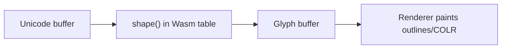

# QR Font (HarfBuzz WASM Shaper)

An experimental font that encodes whatever you type as a scannable QR code — at **shape time**, not bake time.

## Is HarfBuzz WASM real?

**Yes — with an important caveat.** Since HarfBuzz 8.0 there is an experimental [**WASM shaper**](https://github.com/harfbuzz/harfbuzz/blob/main/docs/wasm-shaper.md): you embed a WebAssembly module in a font's `Wasm` OpenType table, and HarfBuzz runs your `shape()` function instead of (or after) OpenType layout.

What it is **not**: a general "programmable font renderer." WASM in HarfBuzz controls **shaping** only — mapping Unicode → glyph IDs and setting advances/offsets. It does **not** draw outlines, run COLRv1 paint graphs, or rasterize pixels. Glyph appearance still comes from ordinary font tables (`glyf`, `CFF`, `COLR`, bitmaps, etc.).

Maintainers describe the API as a **technology preview**, not stable ([discussion #4799](https://github.com/harfbuzz/harfbuzz/discussions/4799)). It is **off by default** in HarfBuzz builds and requires [wasm-micro-runtime (WAMR)](https://github.com/bytecodealliance/wasm-micro-runtime) at compile time (`-Dwasm=enabled`).

## How the WASM shaper API works



### Entry point

Your WASM module must export:

```rust
pub fn shape(
    shape_plan: u32,   // usually ignored
    font: u32,         // opaque font token
    buffer: u32,       // opaque buffer token
    features: u32,     // feature array pointer
    num_features: u32,
) -> i32              // non-zero = success
```

### Buffer model

1. `buffer_copy_contents` — read input as `glyph_info_t[]` + `glyph_position_t[]`
2. On input, `info.codepoint` holds **Unicode scalar values**
3. On output, `info.codepoint` holds **glyph IDs**; `position` holds advances/offsets
4. `buffer_set_contents` — write the shaped result back

Each output item needs a monotonically increasing `cluster` for cursor/hit testing.

### Host API (selected)

| Function | Purpose |
|----------|---------|
| `shape_with(font, buffer, features, n, "ot")` | Run OpenType shaping, then post-process |
| `font_get_glyph(font, unicode, variation)` | cmap lookup |
| `font_get_glyph_h_advance(font, glyph)` | Default advance |
| `font_get_glyph_extents` / `font_get_glyph_outline` | Metrics and beziers |
| `face_reference_table(face, "Font")` | Read nested font blobs (see *inception* example) |
| `buffer_get_direction` / `buffer_get_script` | Layout context |

Low-level definitions live in [`hb-wasm-api.h`](https://github.com/harfbuzz/harfbuzz/blob/main/src/hb-wasm-api.h). The [`harfbuzz-wasm`](https://github.com/harfbuzz/harfbuzz-wasm-examples/tree/main/harfbuzz-wasm) Rust crate wraps these for `wasm32` targets.

### Building a WASM font

1. Compile Rust (or C) to `wasm32` with a exported `shape` function
2. Start from a normal `.ttf` with the glyphs your shaper references
3. Inject the binary: `otfsurgeon -i base.ttf add -o out.ttf Wasm < module.wasm`

See [harfbuzz-wasm-examples](https://github.com/harfbuzz/harfbuzz-wasm-examples) for nastaliq, shadow, calculator, inception, etc.

## This project: QR codes as glyphs

**Idea:** type `https://example.com` → the shaper runs QR encoding at layout time → emits one **module** glyph per dark square, positioned on a grid with `x_offset`/`y_offset`, plus a trailing **space** glyph whose advance equals the QR width.

```
Input text ──► QrCode::new() ──► grid of glyph 2 (■) ──► renderer
```

This follows the same pattern as the **inception** and **calculator** examples: computation in WASM, visuals from pre-defined glyphs.

### Base font glyphs

| ID | Name | Role |
|----|------|------|
| 1 | `space` | Zero-outline spacer; carries total QR width as `x_advance` |
| 2 | `module` | 40×40 unit filled square |

### Build

```bash
cd qr-font-wasm
pip install -r requirements.txt
cargo install wasm-pack   # once
rustup target add wasm32-unknown-unknown
make
# → build/QRFont-Wasm.ttf
```

**Note:** Rust 1.86+ no longer allows undefined WASM imports by default. This project sets `#[link(wasm_import_module = "env")]` on the vendored `harfbuzz-wasm` imports and adds `.cargo/config.toml` with `-Clink-arg=--allow-undefined` for compatibility.

### Preview without HarfBuzz

```bash
python3 scripts/preview_expected.py 'hello world'
```

### Try it

You need a HarfBuzz build with WASM enabled. The examples repo ships [FontGoggles for M1](https://github.com/harfbuzz/harfbuzz-wasm-examples/tree/main/fontgoggles-wasm-m1); otherwise build HarfBuzz with `-Dwasm=enabled` and use `hb-shape`:

```bash
echo 'https://example.com' | hb-shape --shaper=wasm build/QRFont-Wasm.ttf --font-size=16
```

You should see hundreds of glyph `2` entries with offsets forming a square, then glyph `1` with a large advance.

### Limitations

- **Experimental stack** — not for production fonts yet
- **QR version grows with payload** — long URLs mean large glyph streams
- **Quiet zone** — not modeled; add margin glyphs or padding in a future revision
- **Error correction / binary mode** — uses default `qrcode` crate settings (UTF-8)

## Layout of this repo

```
qr-font-wasm/
  src/lib.rs           # WASM shaper (QR encoder)
  harfbuzz-wasm/       # Vendored Rust bindings (from HB examples)
  scripts/
    build_base_font.py # Minimal TTF with space + module glyphs
    embed_wasm.py      # Writes Wasm table
  build/               # Generated artifacts (gitignored)
```

## Further reading

- [wasm-shaper.md](https://github.com/harfbuzz/harfbuzz/blob/main/docs/wasm-shaper.md) — official docs
- [harfbuzz-wasm-examples](https://github.com/harfbuzz/harfbuzz-wasm-examples) — nastaliq, shadow, calculator, inception…
- [HarfBuzz hb-paint API](https://harfbuzz.github.io/harfbuzz-hb-paint.html) — separate from WASM; for COLRv1 rendering
